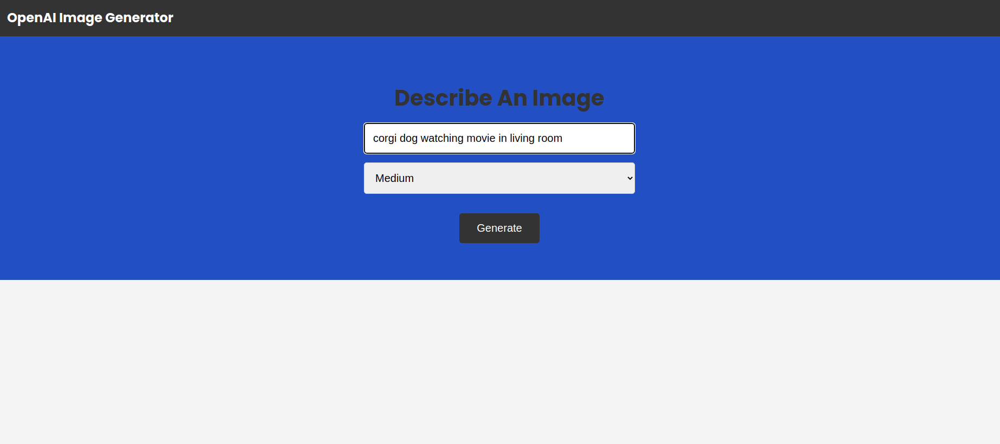
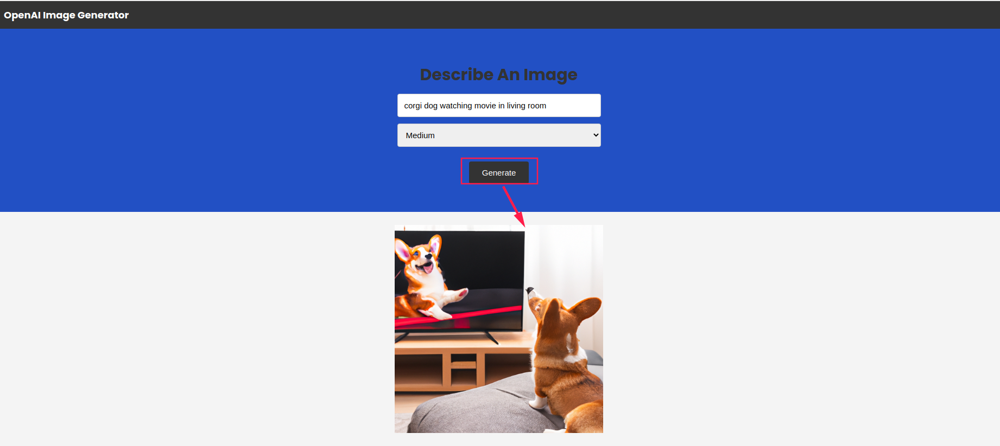

# Node.JS & OpenAI Image Generator

Image generator built with Node.js and Express that uses [OpenAI's Dall-E models](https://beta.openai.com/docs/guides/images) to generate images.

## Usage
If your Run it in a Containaized environment like `Docker`

Make sure `Docker` is intalled in your PC `docker -v`.

Makesure `make` is installed to use `Makefile`

```bash
sudo apt install make
```
Rename the `example.env` file to `.env`.

Generate an API KEY at [OpenAI](https://platform.openai.com) and add it to the `.env` file.

Build Docker Image of the AI Image Generator app
```bash
make app-build
```

Run server

```bash
make app-run
```
Stop and Remove The `Image Generator` Container

```bash
make app-stop
```
## If You choose to go Non Containized way

Install the dependencies

```bash
npm install
```

Run server

```bash
npm start
```

Finally, Visit `http://localhost:5000` in your browser.

The endpoint is at `POST http://localhost:5000/openai/generateimage`.


- [APP SCREEN1](screenshots/result1.png)
- [APP SCREEN2](screenshots/result2.png)

### SCREEN 1


### SCREEN 2

